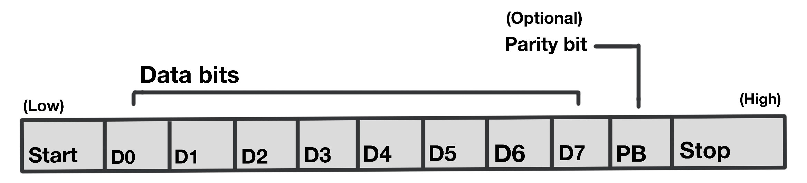
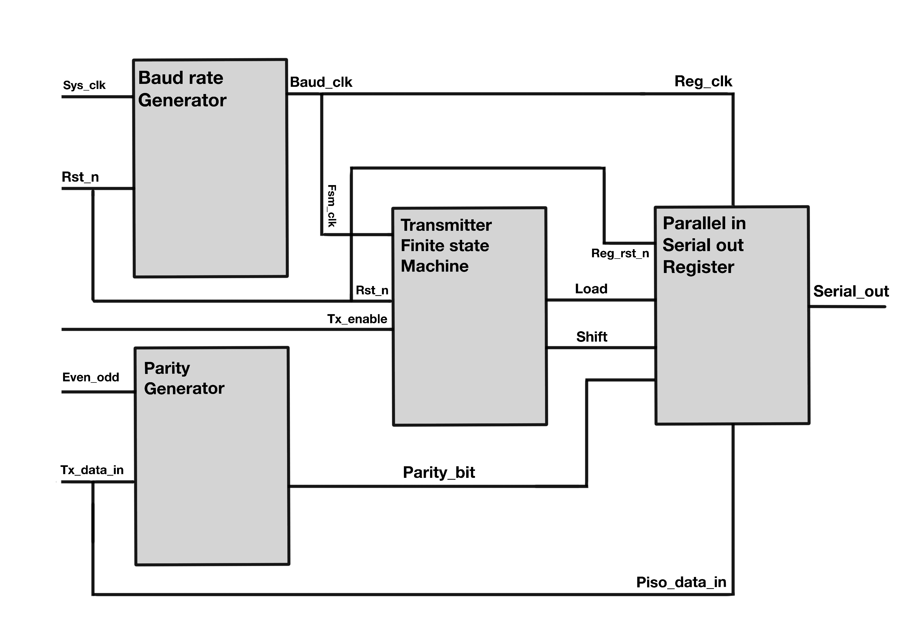
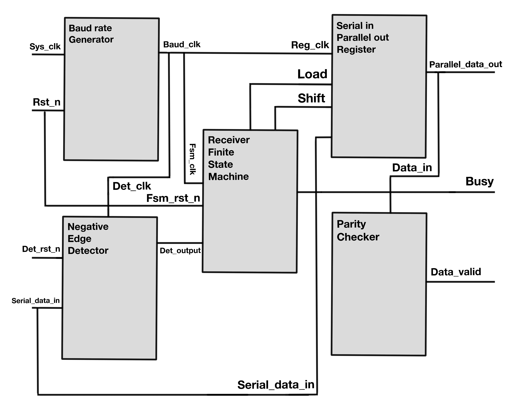
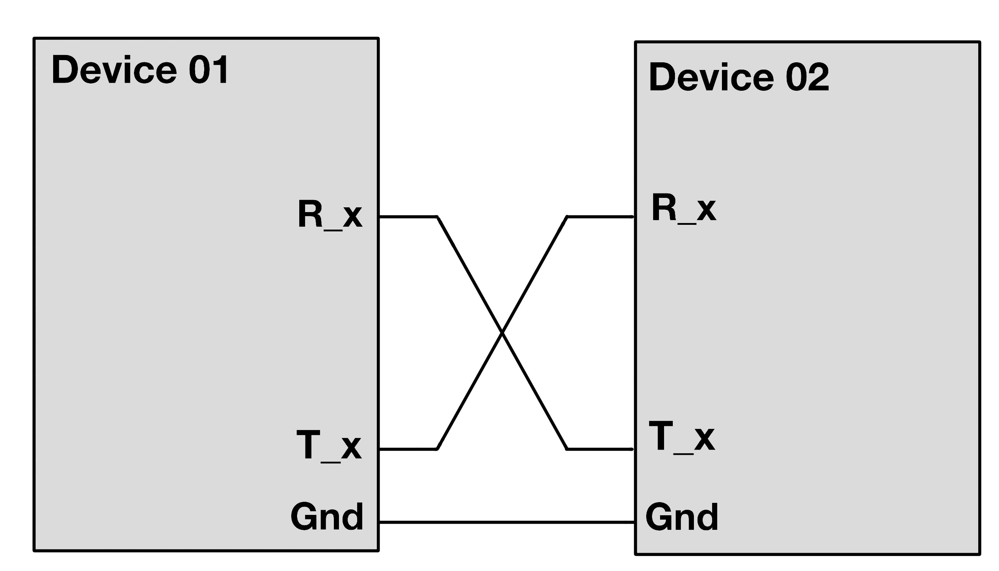

# UART Communication System (Verilog)

This project implements a **UART (Universal Asynchronous Receiver and Transmitter)** communication system in Verilog HDL.  
UART is a widely used protocol for **serial communication** between digital devices such as FPGAs, microcontrollers, and PCs.

---

## 📖 Project Overview

The project implements a UART communication system with the following components:

- **UART Frame Format** (`IMAGES/FIG01.jpg`)  
  The UART frame consists of:
  - Start bit (Low)
  - 8 Data bits (`D0`–`D7`)
  - Optional parity bit
  - Stop bit (High)  

  This defines the structure of each data transmission.  

  

---

- **Device Connection** (`IMAGES/FIG02.jpg`)  
  Two devices (Device 01 and Device 02) are connected with **crossed TX/RX lines** (TX of one to RX of the other) and a **shared ground**, which is typical for UART communication.  

  

---

- **Transmitter Architecture** (`IMAGES/FIG03.jpg`)  
  Includes:
  - **Baud Rate Generator** → produces the clock signal  
  - **Parity Generator** → generates parity bit (optional)  
  - **Finite State Machine (FSM)** → controls transmission sequence  
  - **Parallel-in Serial-out (PISO) Register** → shifts parallel data out serially  

  

---

- **Receiver Architecture** (`IMAGES/FIG04.jpg`)  
  Includes:
  - **Baud Rate Generator** → synchronizes receiver sampling  
  - **Negative Edge Detector** → identifies start bit  
  - **Finite State Machine (FSM)** → manages reception sequence  
  - **Parity Checker** → validates received data  
  - **Serial-in Parallel-out (SIPO) Register** → converts serial input back to parallel data  

  

---

## UART Waveform Signal Description

| **Signal Name** | **Module** | **Direction** | **Description** | **Expected Behavior** |
|-----------------|------------|---------------|-----------------|-----------------------|
| `clk_50mhz` | All | Input | 50 MHz system clock driving the UART modules. | Toggles at 20 ns intervals (50 MHz = 20 ns period), provides base timing. |
| `test_data_in[7:0]` (`din`) | testbench, transmitter | Input | 8-bit data to be transmitted. | Increments from `0x00` to `0xFF` in testbench, each triggers transmission. |
| `write_enable` (`wr_en`) | uart_top, transmitter | Input | Write enable to start transmission. | 1-cycle pulse to start transmission, then returns to `0`. |
| `serial_tx` (`tx`) | uart_top, transmitter | Output | Serial output transmitted data. | UART frame: start bit (0), 8 data bits, stop bit (1). |
| `tx_active` (`tx_busy`) | uart_top, transmitter | Output | Indicates transmitter is busy. | High during transmission (~8.68 µs @115200 baud for 10 bits). |
| `serial_rx` (`rx`) | uart_top, receiver | Input | Serial input received data (loopback). | Mirrors `serial_tx` due to loopback. |
| `rx_data_ready` (`rdy`) | uart_top, receiver | Output | Data received and ready flag. | Goes high for 1 cycle when frame is received/validated. |
| `rx_clear_ready` (`rdy_clr`) | uart_top, receiver | Input | Clears the ready signal. | 1-cycle pulse after `rx_data_ready` to reset flag. |
| `test_data_out[7:0]` (`dout`) | uart_top, receiver | Output | 8-bit received data. | Matches `test_data_in` values after reception. |
| `rx_clock_enable` (`rxclk_en`) | baud_rate_generator | Wire | Clock enable for receiver. | Pulses every 16 cycles of baud clock (~543 ns @115200 baud). |
| `tx_clock_enable` (`txclk_en`) | baud_rate_generator | Wire | Clock enable for transmitter. | Pulses every baud clock (~8.68 µs @115200 baud). |
| `sample_counter` (`sample`) | receiver | Reg | Counter for sampling within bit period. | Counts 0–15 (16x oversampling). |
| `bit_index` (`bitpos`) | transmitter, receiver | Reg | Position of current bit. | Increments 0–7 for data bits, resets after frame. |
| `data_buffer (Tx)` (`scratch`) | transmitter | Reg | Temporary storage for Tx data. | Holds input and shifts bits out sequentially. |
| `data_buffer (Rx)` (`scratch`) | receiver | Reg | Temporary storage for Rx data. | Accumulates received bits, matches transmitted data. |
| `state` | transmitter, receiver | Reg | FSM current state. | Transitions: **IDLE → START → DATA → STOP** (Tx/Rx). |
| `serial_loopback` | testbench | Wire | TX connected to RX for loopback. | Replicates `serial_tx` into `serial_rx`. |
| `test_data_in` | testbench | Reg | Input data for simulation. | Increments from 0–255, triggering transmissions. |

